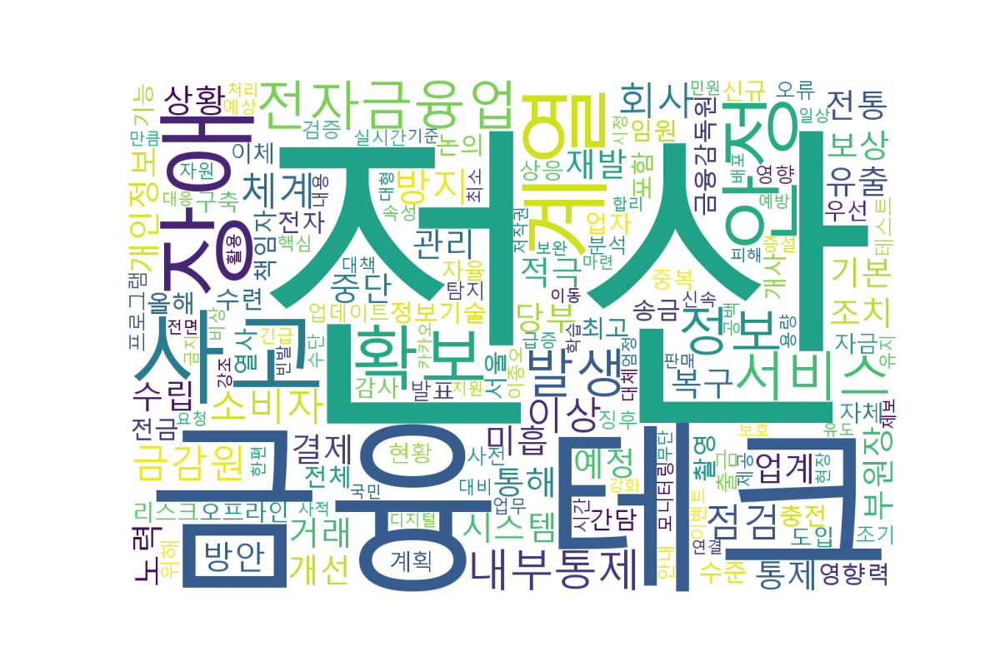

# KoNLPy를 활용한 뉴스 기사 텍스트 분석 프로젝트

## 1. 프로젝트 개요

IT 분야의 최신 동향을 확인하기 위해 최근 IT 뉴스 중 빅테크 관련 기사를 선정하였다.

본 프로젝트에서는 KoNLPy를 이용하여 뉴스 기사 텍스트를 분석하고, 단어별 빈도수를 계산하였다. 또한 WordCloud를 이용한 텍스트 시각화를 통해 기사에서 핵심적으로 언급되는 단어를 한눈에 확인하고자 하였다.

---

## 2. 사용 라이브러리

* requests
* BeautifulSoup4
* re
* KoNLPy (Okt)
* pandas
* PyTorch
* WordCloud

---

## 3. 수행 과정

### 3.1 텍스트 수집

연합뉴스 기사 URL을 이용하여 데이터를 수집하였다.

BeautifulSoup을 이용하여 기사 제목과 본문을 각각 추출하였으며, 추출된 제목과 본문을 하나의 텍스트로 결합하여 분석에 사용하였다.

---

### 3.2 텍스트 정제

정규표현식을 이용하여 한글과 공백을 제외한 숫자, 영문, 특수문자를 제거하였다.

또한 여러 개의 연속된 공백을 하나의 공백으로 변환하여 형태소 분석이 용이하도록 텍스트를 정제하였다.

---

### 3.3 형태소 분석

KoNLPy의 Okt 형태소 분석기를 이용하여 기사 내용에서 명사를 추출하였다.

명사는 문장에서 핵심 의미를 가지는 경우가 많기 때문에 단어 빈도 분석에 적합하다고 판단하였다.

---

### 3.4 불용어 제거

기사 내용을 확인한 후 분석에 의미가 없다고 판단되는 단어를 직접 선정하여 CSV 파일 형태의 불용어 사전을 생성하였다.

이후 불용어 목록을 불러와 해당 단어를 제거하였으며, 한 글자로 이루어진 단어 역시 제거하였다.

---

### 3.5 단어 빈도 계산

불용어 제거 후 남은 단어를 대상으로 출현 빈도를 계산하였다.

이를 통해 기사에서 중요하게 언급되는 핵심 단어를 확인할 수 있었다.

---

### 3.6 PyTorch Tensor 변환

단어를 Vocabulary로 구성한 뒤 각 단어를 정수 값으로 변환하였다.

이후 PyTorch Tensor 형태로 변환하여 텍스트 데이터를 딥러닝 모델에서 사용할 수 있는 수치형 데이터 형태로 표현하였다.

---

### 3.7 WordCloud 생성

단어 빈도 정보를 기반으로 WordCloud를 생성하였다.

출현 빈도가 높은 단어일수록 큰 크기로 표시되도록 하여 기사에서 중요하게 다루어지는 키워드를 시각적으로 표현하였다.

---

## 4. 결과 분석

분석 결과 '전산', '금융', '테크' 등의 단어가 높은 빈도로 등장하는 것을 확인할 수 있었다.

기사에서 사용된 '빅테크'라는 단어는 형태소 분석 과정에서 '빅'과 '테크'로 분리되어, 최종 결과에서는 '테크'가 주요 단어로 나타났다.

WordCloud 시각화를 통해 기사 전체를 읽지 않더라도 핵심 키워드를 직관적으로 확인할 수 있었다.

---

## 5. 결론

KoNLPy를 활용한 형태소 분석과 단어 빈도 계산을 통해 비정형 텍스트 데이터에서도 의미 있는 정보를 추출할 수 있음을 확인하였다.

또한 WordCloud를 이용한 시각화를 통해 방대한 텍스트를 모두 읽지 않더라도 핵심 키워드를 직관적으로 파악할 수 있다는 점에서 효과적임을 확인할 수 있었다.
